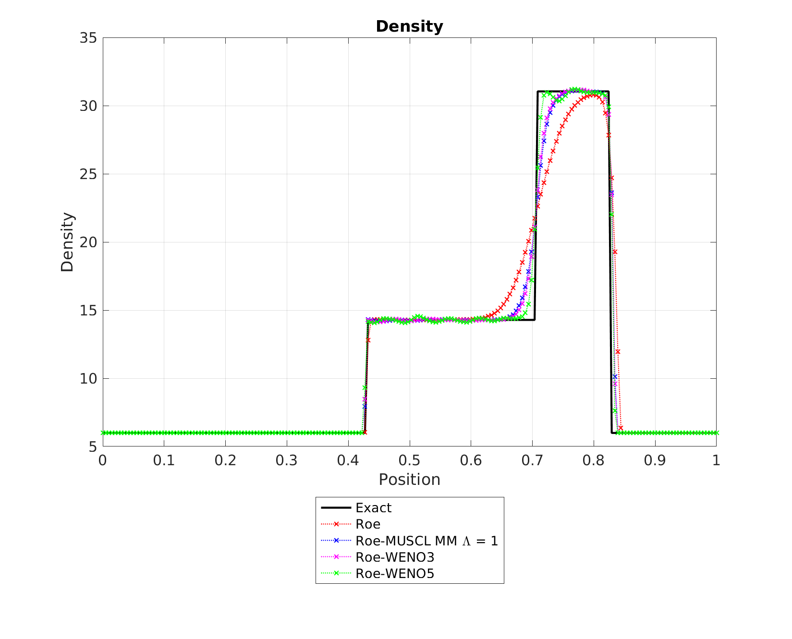
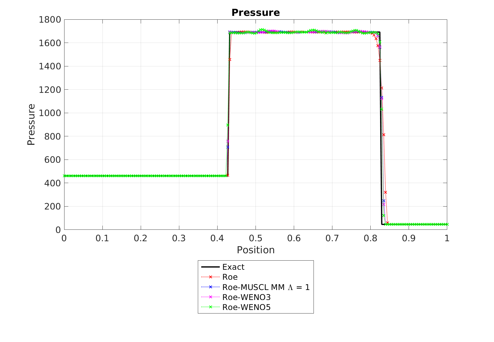
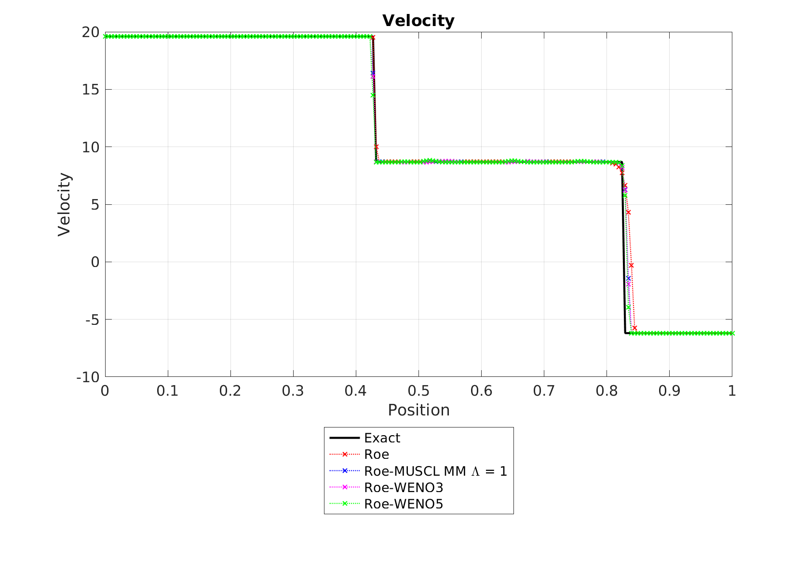
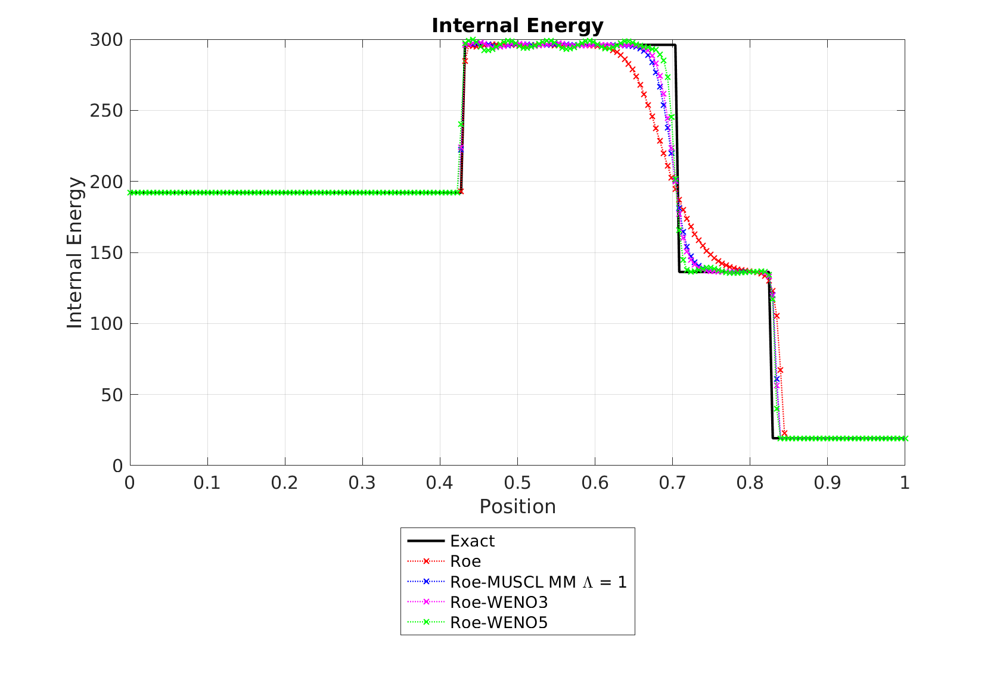

# Josh Fowler

**Computational Engineer | CFD · Numerical Methods · HPC**

Mechanical engineer specializing in computational science and engineering, with a focus on computational fluid dynamics, numerical methods, scientific computing, and thermal-fluid systems.

My work focuses on developing and applying numerical methods to complex engineering problems, from governing equations and numerical formulation through implementation, verification, validation, and analysis.

Current interests include high-order methods for hyperbolic conservation laws, shock-capturing schemes, numerical linear algebra, and high-performance scientific computing.

## Research & Technical Interests

- Computational Fluid Dynamics
- Numerical PDEs
- Hyperbolic Conservation Laws
- Finite Volume Methods
- High-Order Numerical Methods
- WENO and Shock-Capturing Schemes
- Approximate Riemann Solvers
- Numerical Linear Algebra
- High-Performance Computing
- Scientific Software Engineering

## Selected Computational Work

### Hybrid Roe-WENO Euler Solver

For my M.S. research, I developed a finite-volume solver for the compressible Euler equations to investigate a hybrid Roe-WENO numerical method.

The solver was developed from scratch and has been implemented independently in:

- [MATLAB](https://github.com/josh-fowler-hub/HighOrderEuler-MATLAB)
- [C++](https://github.com/josh-fowler-hub/HighOrderEuler-Cpp)
- [Python](https://github.com/josh-fowler-hub/PyHighOrderEuler)
- [Julia](https://github.com/josh-fowler-hub/HighOrderEuler.jl)

The research examined the accuracy and stability effects of introducing central differencing into the average-flux contribution of the Roe numerical flux while retaining WENO reconstruction for shock capturing.

The one-dimensional Euler equations are written in conservation form as

```math
\frac{\partial \mathbf{U}}{\partial t}
+
\frac{\partial \mathbf{F}(\mathbf{U})}{\partial x}
=
0
```

where

```math
\mathbf{U}
=
\begin{bmatrix}
\rho \\
\rho u \\
E
\end{bmatrix}
```

The implementations model nonlinear wave propagation including shock waves, contact discontinuities, and expansion waves.

<table>
  <tr>
    <td width="50%" align="center">
      
      <br>
      <em>Density</em>
    </td>
    <td width="50%" align="center">
      
      <br>
      <em>Pressure</em>
    </td>
  </tr>
  <tr>
    <td width="50%" align="center">
      
      <br>
      <em>Velocity</em>
    </td>
    <td width="50%" align="center">
      
      <br>
      <em>Internal Energy</em>
    </td>
  </tr>
</table>

<p align="center">
  <em>Comparison of Roe and Roe-MUSCL solutions for a compressible-flow benchmark problem.</em>
</p>

#### Numerical Methods

The research and implementations involve:

- finite-volume discretization
- Roe approximate Riemann solver
- WENO reconstruction
- MUSCL reconstruction
- explicit time integration
- shock-capturing methods
- nonlinear conservation laws
- numerical stability analysis
- comparison against established benchmark solutions

<!--
=============================================================================
FUTURE FIGURE — CLASSICAL RIEMANN PROBLEM

Recommended:
Sod shock tube or another canonical verification problem.

Best presentation:
Numerical solution compared directly against the exact/reference solution.

Suggested quantities:
- density
- velocity
- pressure

Suggested path:
assets/roe-weno/sod-shock-tube.png

When ready:

<p align="center">
  
</p>

<p align="center">
  <em>Numerical solution compared with the exact Riemann solution for the
  Sod shock-tube problem.</em>
</p>
=============================================================================
-->

#### Verification & Numerical Analysis

A numerical solution is useful only when its behavior is understood.

My work emphasizes comparison against analytical or established reference solutions, investigation of numerical stability, and quantitative evaluation of discretization error and solution accuracy.

<!--
=============================================================================
FUTURE FIGURE — DIFFICULT SHOCK-CAPTURING CASE

Recommended:
Use a benchmark that demonstrates behavior not visible in the Sod problem.

Good candidates:
- Shu-Osher shock/entropy-wave interaction
- interacting blast waves
- another high-gradient benchmark from the thesis

Suggested path:
assets/roe-weno/shock-interaction.png

When ready:

<p align="center">
  
</p>

<p align="center">
  <em>High-order resolution of a compressible-flow benchmark containing
  strong nonlinear wave interactions.</em>
</p>
=============================================================================
-->

<!--
=============================================================================
FUTURE FIGURE — CONVERGENCE / ERROR

HIGH PRIORITY

Recommended:
Log-log plot of an error norm versus grid spacing.

Possible quantities:
- L1 error
- L2 error
- Linf error

If appropriate, include a reference slope showing the theoretical or measured
order of accuracy.

Suggested path:
assets/roe-weno/convergence.png

When ready:

<p align="center">
  
</p>

<p align="center">
  <em>Grid-convergence behavior of the numerical method.</em>
</p>
=============================================================================
-->

## Computational Engineering

My broader engineering work has involved computational analysis of thermal-fluid and high-speed-flow systems, including CFD, heat transfer, aerodynamics, and multidisciplinary engineering problems.

I am particularly interested in computational problems where numerical behavior, physical modeling, and engineering interpretation must all be considered together.

<!--
=============================================================================
FUTURE FIGURE — GENERAL CFD / THERMAL-FLUID ANALYSIS

Only include a non-proprietary result that adds a substantially different
type of analysis from the Euler solver work.

Good candidates:
- OpenFOAM verification problem
- conjugate heat-transfer benchmark
- natural-convection benchmark
- external aerodynamic benchmark
- mesh-refinement study

Suggested path:
assets/cfd/thermal-fluid-example.png
=============================================================================
-->

## Technical Background

**Programming**

C++ · Julia · Python · MATLAB

**Computational Engineering**

CFD · FEA · OpenFOAM · ANSYS Fluent · Thermal-Fluid Analysis

**Numerical Methods**

Finite Volume Methods · WENO · MUSCL · Riemann Solvers · Numerical PDEs · Iterative Methods · Optimization

**High-Performance Computing**

MPI · Parallel Computing · Performance-Oriented Scientific Computing

## Current Technical Interests

I am currently expanding my work in computational science and engineering, particularly in:

- scalable numerical algorithms
- high-order methods for conservation laws
- Krylov subspace methods
- sparse numerical linear algebra
- distributed-memory parallelism
- GPU computing
- performance analysis and optimization
- verification and validation of numerical software

<!--
=============================================================================
FUTURE FIGURE — HPC PERFORMANCE

Only add this once real benchmark data exists.

Possible examples:

Strong Scaling
    x: MPI ranks
    y: runtime, speedup, or parallel efficiency

Weak Scaling
    x: MPI ranks
    y: runtime or parallel efficiency

Solver Performance
    x: problem size
    y: runtime, throughput, or memory bandwidth

Suggested path:
assets/hpc/strong-scaling.png
=============================================================================
-->

---

<p align="center">
  <em>Building computational tools from the governing equations up.</em>
</p>
